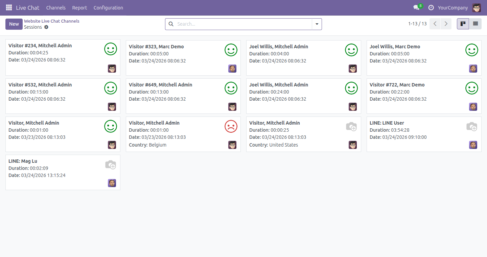
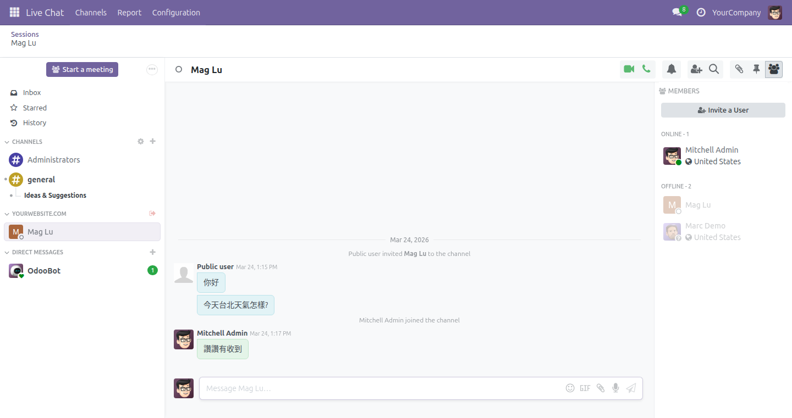
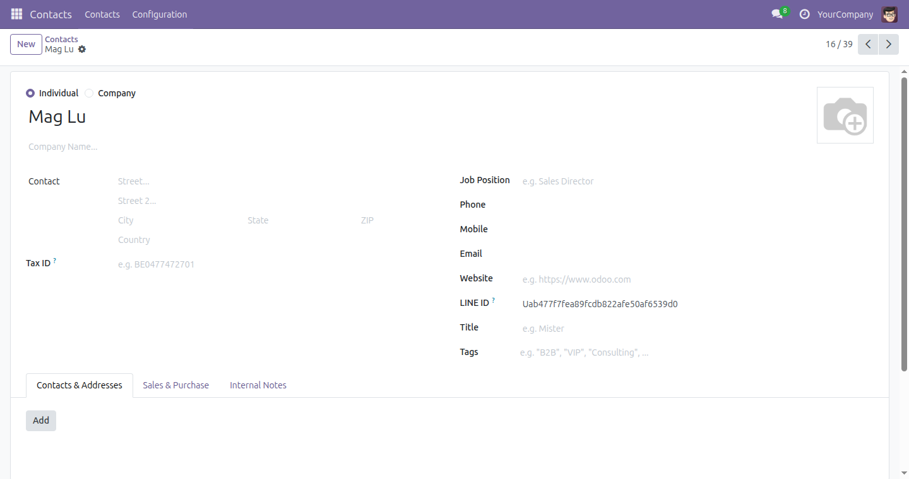
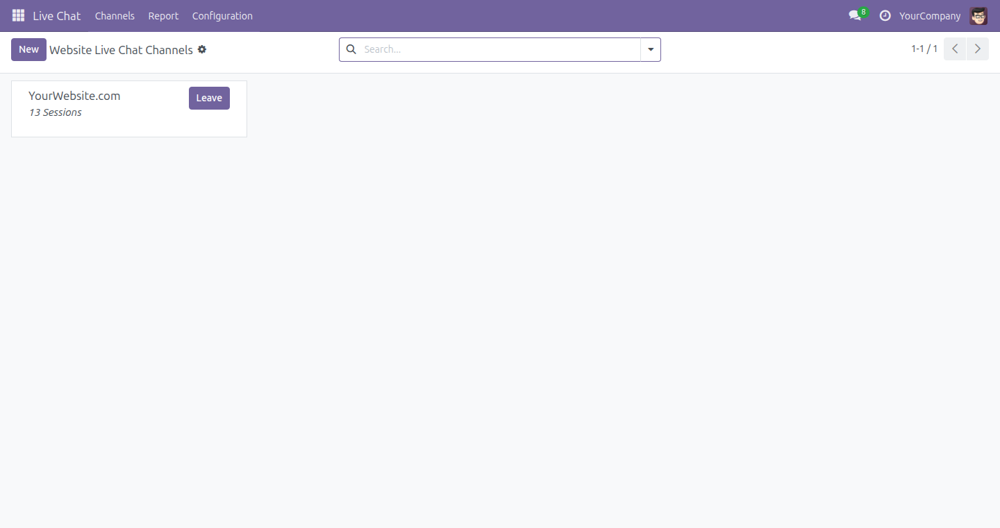

<p align="center">
  
</p>

<h1 align="center">LiveChat LINE 整合模組</h1>

<p align="center">
  將 LINE Messaging API 與 Odoo LiveChat 整合，實現 LINE 使用者與 Odoo 客服人員之間透過標準 Discuss 介面的雙向即時通訊。
</p>

<p align="center">
  <a href="#概述">概述</a> &bull;
  <a href="#功能特色">功能特色</a> &bull;
  <a href="#系統架構">系統架構</a> &bull;
  <a href="#畫面截圖">畫面截圖</a> &bull;
  <a href="#安裝方式">安裝方式</a> &bull;
  <a href="#設定說明">設定說明</a> &bull;
  <a href="#安全性">安全性</a> &bull;
  <a href="#api-參考">API 參考</a> &bull;
  <a href="#測試">測試</a> &bull;
  <a href="#變更紀錄">變更紀錄</a> &bull;
  <a href="#技術支援">技術支援</a> &bull;
  <a href="#授權條款">授權條款</a>
</p>

<p align="center">
  
  
  
  
  
</p>

<p align="center">
  <a href="README.md">English</a>
</p>

---

## 概述

**woow_odoo_livechat_line** 將 LINE 官方帳號連接至 Odoo 18 LiveChat，將收到的 LINE 訊息路由至 Discuss 頻道，讓客服人員可以即時回覆。所有媒體類型——圖片、影片、音訊、檔案、貼圖及位置——皆支援雙向傳輸。

### 為什麼需要此模組？

| 面臨的挑戰 | 解決方案 |
|-----------|----------|
| LINE 客戶無法聯繫您的 Odoo 客服中心 | Webhook 端點接收 LINE 事件並自動建立 LiveChat 工作階段 |
| 客服人員必須在 LINE 官方帳號管理後台與 Odoo 之間來回切換 | 所有 LINE 對話都會出現在 Odoo Discuss 中——統一的收件匣 |
| LINE 與 Odoo CRM 之間沒有客戶身份連結 | 自動建立帶有 `line_user_id` 的 `res.partner`；另提供手動綁定精靈 |
| 媒體檔案被鎖在 LINE 平台中 | 圖片、影片、音訊和文件以 Odoo 附件形式傳輸，並附有公開存取權杖 |
| 多個 LINE 官方帳號 | 多租戶支援：每個 LiveChat 頻道對應各自的 LINE 頻道憑證 |
| Webhook 端點的安全疑慮 | 每個傳入請求皆進行 HMAC-SHA256 簽章驗證 |

---

## 功能特色

### LINE 頻道設定

- 可針對每個 LiveChat 頻道啟用/停用 LINE 整合
- 將 LINE Channel ID 和 Channel Secret 安全地儲存在 Odoo 中
- 自動計算的 Webhook URL 顯示在頻道表單中
- 驗證約束確保啟用時憑證已填寫

### Webhook 與簽章驗證

- 公開端點 `/line/webhook/<channel_id>` 接收 LINE 平台回呼
- 使用 Channel Secret 進行 HMAC-SHA256 簽章驗證
- 優雅地處理無效或已停用的頻道

### 訪客與聯絡人管理

- 為新的 LINE 使用者自動建立 `mail.guest`
- 整合 LINE Profile API 取得 `displayName` 和 `pictureUrl`
- 自動建立帶有 `line_user_id` 欄位的 `res.partner`
- `mail.guest` 和 `res.partner` 的 `line_user_id` 皆有 SQL 唯一約束
- LINE 訪客連結夥伴精靈，用於手動訪客與夥伴的綁定

### 訊息類型

| 類型 | LINE 至 Odoo | Odoo 至 LINE |
|------|:---:|:---:|
| 文字 | 支援 | 支援 |
| 圖片 | 支援 | 支援 |
| 影片 | 支援 | 支援 |
| 音訊 | 支援 | 支援 |
| 檔案 / 文件 | 支援 | 支援（Flex Message） |
| 貼圖 | 支援（以文字呈現） | -- |
| 位置 | 支援（以文字呈現，附 Google Maps 連結） | -- |

### 媒體傳輸

- 從 LINE Content API 下載二進位內容
- 建立帶有正確 MIME 類型的 Odoo `ir.attachment` 記錄
- 產生用於公開 URL 存取的 `access_token`
- 所有傳送至 LINE 的媒體皆強制使用 HTTPS URL
- 外送影片訊息的預覽縮圖產生
- 用於檔案下載的 Flex Message 卡片（樣式符合 LINE 原生 UI）

### 雙向訊息傳遞

- **LINE 至 Odoo**：Webhook 接收事件，在 Discuss 頻道中建立 `mail.message`
- **Odoo 至 LINE**：`mail.message.create` 覆寫偵測客服人員的回覆，並透過 Push API 推送至 LINE
- 上下文旗標 `from_line_webhook` 防止訊息迴圈
- 批次推送：LINE 每次請求最多允許 5 則訊息；模組自動進行批次處理

### 多租戶支援

- 每個 `im_livechat.channel` 持有各自的 LINE 憑證
- 以頻道 ID 為鍵的權杖快取，避免重複的 OAuth 呼叫
- 多個 LINE 官方帳號可在同一 Odoo 實例上共存

---

## 系統架構

```
+------------------+          +------------------+          +------------------+
|                  |          |                  |          |                  |
|   LINE App 使用者 |  <-----> |   LINE 平台      |  <-----> |   Odoo 伺服器    |
|                  |          |                  |          |                  |
+------------------+          +------------------+          +------------------+
                                     |    ^                        |    ^
                                     |    |                        |    |
                              Webhook |    | Push API        Discuss |    | mail.message
                              Events  |    | Messages       Channel |    | create()
                                     v    |                        v    |
                              +------------------+          +------------------+
                              | /line/webhook/   |          | 客服人員         |
                              | <channel_id>     |  ------> | （Discuss UI）   |
                              +------------------+          +------------------+
```

### 請求流程

```
LINE 使用者傳送訊息
    |
    v
LINE 平台 --- POST /line/webhook/<channel_id> ---> Odoo
    |
    +-- 驗證 X-Line-Signature（HMAC-SHA256）
    +-- 查找/建立 mail.guest（取得 LINE 個人資料）
    +-- 查找/建立 res.partner（自動連結）
    +-- 查找/建立 discuss.channel
    +-- 下載媒體內容（如適用）
    +-- 在頻道中張貼 mail.message
    |
客服人員在 Discuss 中回覆
    |
    v
mail.message.create() 覆寫
    |
    +-- 偵測 LINE 頻道（存在 line_user_id）
    +-- 建構 LINE 訊息物件（文字、圖片、影片、音訊、flex）
    +-- 確保 HTTPS URL
    +-- 透過 LINE Messaging API 推送
    |
    v
LINE 使用者收到回覆
```

---

## 模組相依性

| 模組 | 用途 |
|--------|---------|
| `im_livechat` | LiveChat 頻道基礎架構、客服人員指派、工作階段管理 |
| `mail` | `mail.guest`、`mail.message`、`discuss.channel`、附件處理 |

---

## 畫面截圖

<p align="center">
  
  <br/><em>LiveChat 工作階段顯示 LINE 對話及客服人員指派</em>
</p>

<p align="center">
  
  <br/><em>Discuss 介面中的 LINE 對話，支援雙向訊息傳遞</em>
</p>

<p align="center">
  
  <br/><em>夥伴表單顯示 LINE User ID 欄位，用於 CRM 整合</em>
</p>

<p align="center">
  
  <br/><em>工作階段看板檢視，LINE 項目與網頁 LiveChat 工作階段並列顯示</em>
</p>

---

## 安裝方式

### 前置條件

- Odoo 18 社群版或企業版
- Python 3.10 或更高版本
- PostgreSQL 13 或更高版本
- 可從網際網路存取的 HTTPS 端點（LINE Messaging API 之要求）
- 已啟用 Messaging API 的 LINE 官方帳號

### 安裝步驟

1. 將模組複製或克隆至您的 Odoo addons 目錄：

   ```bash
   git clone https://github.com/WOOWTECH/woow_odoo_livechat_line.git \
       /path/to/odoo/addons/woow_odoo_livechat_line
   ```

2. 安裝 Python 相依套件（通常已預先安裝）：

   ```bash
   pip install requests
   ```

3. 重新啟動 Odoo 並更新模組清單：

   ```bash
   odoo -u base --stop-after-init
   ```

4. 前往**應用程式**，搜尋 **LiveChat LINE Integration**，然後點擊**安裝**。

---

## 設定說明

### 1. LINE 開發者控制台

1. 登入 [LINE Developers Console](https://developers.line.biz/console/)。
2. 建立一個 **Provider**（或使用現有的）。
3. 建立一個 **Messaging API** 頻道。
4. 從 **Basic settings** 分頁中記下 **Channel ID** 和 **Channel Secret**。
5. 在 **Messaging API** 分頁下：
   - 將 **Webhook URL** 設定為：
     ```
     https://your-odoo-domain.com/line/webhook/<livechat_channel_id>
     ```
   - 將 **Use webhook** 切換為**啟用**。
   - 將 **Auto-reply messages** 切換為**停用**。
   - 將 **Greeting messages** 切換為**停用**（建議）。
6. Channel Access Token 會透過 OAuth 自動取得，無需手動輸入權杖。

### 2. Odoo LiveChat 頻道

1. 前往**即時聊天 > 設定 > 頻道**。
2. 開啟（或建立）一個 LiveChat 頻道。
3. 在 **LINE Integration** 區段中：
   - 勾選 **Enable LINE Integration**。
   - 輸入 **LINE Channel ID**。
   - 輸入 **LINE Channel Secret**。
4. **Webhook URL** 欄位為自動計算——將其複製到 LINE 開發者控制台。
5. 儲存頻道。
6. 確保至少已指派一名**客服人員**至該頻道。

### 3. HTTPS / 反向代理

LINE 要求所有 Webhook URL 使用 HTTPS。常見設定方式：

| 設定方式 | 說明 |
|-------|-------|
| 搭配 Let's Encrypt 的 Nginx 反向代理 | 建議用於正式環境 |
| Cloudflare 通道 | 零設定 HTTPS |
| Odoo.sh | 自動提供 HTTPS |
| `odoo.conf` 中設定 `proxy_mode = True` | 在反向代理後方時為必要設定 |

將 `web.base.url` 設定為您的公開 HTTPS 網域，以確保傳送至 LINE 的媒體 URL 有效：

```
Settings > Technical > Parameters > System Parameters
Key:   web.base.url
Value: https://your-odoo-domain.com
```

---

## 安全性

### 權限模型

```
+-------------------------+     +----------------------------+
| im_livechat_group_user  |     | im_livechat_group_manager  |
| （LiveChat 客服人員）     |     | （LiveChat 管理員）         |
+-------------------------+     +----------------------------+
| - 讀取 LINE 訊息        |     | - 所有客服人員權限          |
| - 回覆 LINE 使用者      |     | - 設定 LINE 頻道           |
| - 使用連結精靈          |     | - 檢視 Channel Secret      |
+-------------------------+     +----------------------------+
```

### Webhook 安全性

| 層級 | 機制 |
|-------|-----------|
| 傳輸層 | 必須使用 HTTPS（LINE 會拒絕 HTTP Webhook URL） |
| 身份驗證 | 每個請求皆進行 HMAC-SHA256 簽章驗證 |
| 授權 | 頻道必須存在且 `line_enabled = True` |
| 輸入驗證 | 格式錯誤的 JSON 或缺少欄位會被靜默拒絕 |
| XSS 防護 | 使用者提供的內容（位置標題、地址）透過 `markupsafe.escape` 進行跳脫處理 |

### 資料保護

- LINE Channel Secret 儲存在資料庫中（為符合合規要求，請確保資料庫層級加密）。
- 存取權杖僅快取在記憶體中——絕不寫入磁碟。
- `line_user_id` 欄位具有 SQL 唯一約束，以防止資料重複。
- `ir.attachment` 上的 `access_token` 為每個附件獨立產生，用於公開媒體 URL。

---

## API 參考

### Webhook 端點

```
POST /line/webhook/<int:channel_id>
```

| 參數 | 類型 | 說明 |
|-----------|------|-------------|
| `channel_id` | `int`（路徑參數） | Odoo `im_livechat.channel` 記錄 ID |

**標頭**

| 標頭 | 必填 | 說明 |
|--------|----------|-------------|
| `X-Line-Signature` | 是 | 請求主體的 HMAC-SHA256 簽章 |
| `Content-Type` | 是 | `application/json` |

**回應**：`200 OK`，回傳空 JSON 物件 `{}`。LINE 要求在 1 秒內回傳 200 狀態碼。

### Webhook 事件

| 事件類型 | 是否處理 | 動作 |
|------------|:---:|--------|
| `message`（文字） | 是 | 建立帶有文字內容的 `mail.message` |
| `message`（圖片） | 是 | 下載內容，建立附件 |
| `message`（影片） | 是 | 下載內容，建立附件 |
| `message`（音訊） | 是 | 下載內容，建立附件 |
| `message`（檔案） | 是 | 下載內容，建立附件 |
| `message`（貼圖） | 是 | 建立文字訊息 `[Sticker: packageId/stickerId]` |
| `message`（位置） | 是 | 建立帶有 Google Maps 連結的文字訊息 |
| `follow` | 是 | 記錄日誌（不採取動作） |
| `unfollow` | 是 | 記錄日誌（不採取動作） |
| 其他事件 | 否 | 記錄為除錯日誌，靜默忽略 |

### LINE API 呼叫（外送）

| API | 方法 | 用途 |
|-----|--------|---------|
| `POST /v2/oauth/accessToken` | OAuth | 取得頻道存取權杖 |
| `GET /v2/bot/profile/{userId}` | Profile | 取得 LINE 使用者顯示名稱與圖片 |
| `GET /v2/bot/message/{messageId}/content` | Content | 下載媒體二進位資料 |
| `POST /v2/bot/message/push` | Push | 傳送訊息至 LINE 使用者 |

### 模型參考

| 模型 | 類型 | 新增欄位 |
|-------|------|-------------|
| `im_livechat.channel` | 擴充 | `line_enabled`、`line_channel_id`、`line_channel_secret`、`line_webhook_url` |
| `discuss.channel` | 擴充 | `line_user_id`、`line_display_name`、`line_picture_url` |
| `mail.guest` | 擴充 | `line_user_id`、`line_partner_id` |
| `res.partner` | 擴充 | `line_user_id` |
| `mail.message` | 擴充 | `create()` 覆寫，用於外送 LINE 推播 |
| `line.api.mixin` | 抽象 | 權杖快取、推播、個人資料、內容、訊息建構器 |
| `line.guest.link.partner.wizard` | 暫存 | `guest_id`、`partner_id`、`action_link()` |

---

## 測試

### 測試摘要

| 指標 | 數值 |
|--------|-------|
| 測試方法總數 | **257** |
| 第 1-5 階段（核心） | 129 |
| 第 6-13 階段（正式環境） | 128 |
| 失敗數 | **0** |
| 錯誤數 | **0** |

### 測試階段（6-13）

| 階段 | 檔案 | 測試數 | 重點 |
|-------|------|:---:|-------|
| 6 | `test_phase06_deployment.py` | 17 | 部署驗證、模組安裝、Webhook 端點 |
| 7 | `test_phase07_contact_binding.py` | 18 | 訪客建立、夥伴自動連結、精靈綁定 |
| 8 | `test_phase08_multi_tenant.py` | 14 | 多 LINE 頻道、憑證隔離 |
| 9 | `test_phase09_https_proxy.py` | 14 | HTTPS URL 強制、代理模式、基礎 URL 處理 |
| 10 | `test_phase10_fault_recovery.py` | 16 | API 失敗、逾時處理、重試邏輯 |
| 11 | `test_phase11_monitoring.py` | 13 | 日誌輸出、錯誤追蹤、診斷 |
| 12 | `test_phase12_data_governance.py` | 18 | 唯一約束、資料完整性、存取控制 |
| 13 | `test_phase13_operations.py` | 18 | 端對端流程、並行操作、邊界情況 |

### 執行測試

```bash
# 執行所有模組測試
odoo --test-enable -i woow_odoo_livechat_line --stop-after-init

# 執行特定測試階段
odoo --test-enable -i woow_odoo_livechat_line \
     --test-tags /woow_odoo_livechat_line --stop-after-init
```

---

## 變更紀錄

### 18.0.1.0.0

- 首次發佈
- LINE Messaging API Webhook 整合
- 雙向文字訊息（LINE <-> Odoo Discuss）
- 媒體傳輸：圖片、影片、音訊、檔案（雙向）
- 貼圖與位置訊息支援（LINE 至 Odoo）
- 用於檔案下載的 Flex Message 卡片（Odoo 至 LINE）
- 從 LINE 個人資料自動建立 `mail.guest` 和 `res.partner`
- LINE 訪客連結夥伴精靈，用於手動綁定
- HMAC-SHA256 Webhook 簽章驗證
- LINE Channel Access Token 的權杖快取
- 多租戶支援（多個 LINE 官方帳號）
- 媒體存取的 HTTPS URL 強制
- 257 個自動化測試，涵蓋 13 個階段，0 個失敗

---

## 技術支援

| 資源 | 連結 |
|----------|------|
| GitHub Issues | [github.com/WOOWTECH/woow_odoo_livechat_line/issues](https://github.com/WOOWTECH/woow_odoo_livechat_line/issues) |
| LINE 開發者文件 | [developers.line.biz/en/docs/messaging-api/](https://developers.line.biz/en/docs/messaging-api/) |
| Odoo LiveChat 文件 | [odoo.com/documentation/18.0/applications/websites/livechat.html](https://www.odoo.com/documentation/18.0/applications/websites/livechat.html) |
| WoowTech | [woowtech.com](https://woowtech.com) |

---

## 授權條款

本模組依 [GNU 較寬鬆通用公共授權條款第 3 版（LGPL-3）](https://www.gnu.org/licenses/lgpl-3.0.html) 授權。

完整授權條款文字請參閱 [LICENSE](LICENSE) 檔案。

---

<p align="center">
  <sub>由 <a href="https://woowtech.com">WoowTech</a> 用心打造 &mdash; Odoo 18 &bull; LINE Messaging API</sub>
</p>
